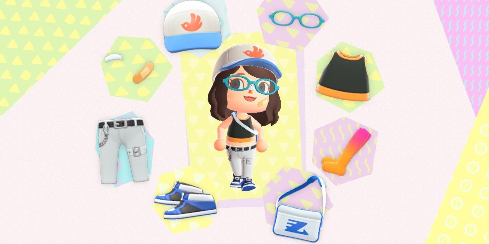
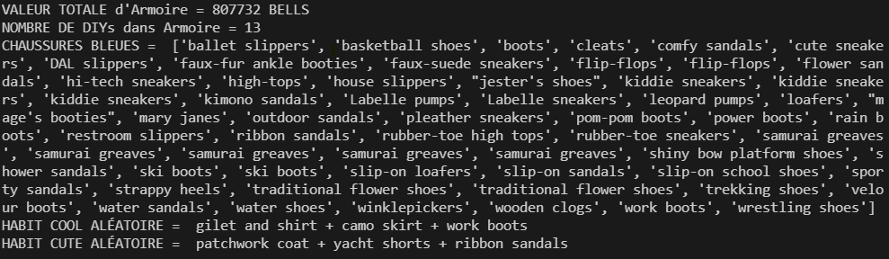

# Projet 2

#### :alarm_clock: [Date de remise le dimanche 19 juin 2022 à 23h59]

## Objectif

Ce TP a pour objectif de pratiquer les fonction, la lectures de fichier, les tests et outils de correction, les bibliothèques scientifiques et graphiques, et programmation orientée objet.

## Critères d'évaluation

Une démarche de qualité et un bon résultat donnent la note maximale. Une erreur minime (ex faute de frappe) mènera à une pénalité de 0.5 points. Puisqu'il s'agit d'un cours de programmation, une attention particulière sera accordée à la qualité du code. La note possible maximale du TP est 100%.

Pour ce projet, je serai très regardante sur la qualité du code et le respect des normes de programmations. À ce point de la session, vous devriez être familiers avec les normes de programmations qu'on vous apprends en classe, par exemple la nomenclature des variables (lowerCamelCase pour les variables et UPPER_CASE pour les constantes)

Un code qui ne roule pas est un 0 automatique, alors testez votre code!!

N'oubliez pas de jeter un oeil aux erreurs courantes de qualité de code dans le fichier [QualiteCode.md](./ressources/QualiteCode.md)

## Rouler le code

Pour ce TP, on aura besoin de la librairie pandas, qui est utilisée pour tout ce qui concerne les dataframes. On peut l'installer en roulant la commande:

```cmd
pip install pandas
```

Le fichier à exécuter pour la partie 1 est `preprocessing.py`, celui pour la partie 2 est `operationsArmoire.py`, et celui pour la partie 3 est `tests.py`. On peut les exécuter comme suit:

```cmd
python preprocessing.py
python operationsArmoire.py
python tests.py
```

## Mise en Contexte

En tant que joueuse professionnelle d'Animal Crossing, je cherche à mettre au point un système qui me permet de gérer mon armoire de vêtements, notamment mes chaussures, mes pantalons et mes chandails.



## Partie 1 - Dataframes

La première partie consiste à utiliser la librairie pandas pour lire les données de tous les hauts, bas et chaussures.
Cependant, avant que les données soient utilisables, il faudra les nettoyer un peu (enlever les doublons, enlever les colonnes dont on n'a pas besoin, etc.)

Il faut donc compléter le fichier preprocessing.py, qui génère un dataset propre et utilisable pour la suite du projet. Les données utilisées viennent de [Kaggle](https://www.kaggle.com/jessicali9530/animal-crossing-new-horizons-nookplaza-dataset?select=bags.csv).

### lireDonnees

La fonction prends en entrée 3 strings représentant des chemins vers des fichiers. On doit lire ces trois fichiers, utiliser pandas pour les transformer en dataframes, et les retourner.

### filtrerColonnes

La fonction prends en entrée un dataframe et une liste de colonnes qu'on veut garder, et retourne un dataframe composé uniquement des colonnes que l'on souhaitait garder.

### renommerColonne

La fonction prends en entrée un dataframe, un vieux nom de colonne et un nouveau nom de colonne, et renomme la colonne référencée par la variable vieuxNom en la variable nouveauNom. La fonction retourne le dataframe dans lequel la colonne spécifiée a été renommée.

### enleverDoublons

La fonction prends en entrée un dataframe avec des lignes en doubles, et retourne un dataframe avec juste des lignes uniques.

### ajouterColonneType

La fonction prends en entrée un dataframe et une valeur de colonne par défaut. On veut ajouter une colonne qui se nomme "Type" à notre dataframe. Elle représente le type d'objet (haut, bas ou chaussures) qui est contenu dans le dataframe. La fonction retourne un dataframe auquel on a ajouté la colonne "Type" avec la valeur par défaut `colType`.

### ajouterColonneBalance

La fonction prends en entrée un dataframe qui contient plusieurs colonnes dont "Buy_Price" (le prix auquel on a acheté le vêtement) et "Sell_Price" (le prix auquel on peut vendre le vêtement). On veut calculer la balance pour chaque vêtement, soit la différence entre le prix de vente et le prix d'achat. Il est normal que la balance soit négative, puisqu'on achète un vêtement plus cher qu'on le vend.

### pretraiterDataframe

Il s'agit de la fonction qu'on utilise pour prétraiter un dataframe. Elle prend en entrée un dataframe et le type d'objets contenu dans ledit dataframe, puis exécute les étapes de prétraitements. La fonction retourne le dataframe prétraité.

### mergerDataframes

La fonction prends en entrée une liste de dataframes, et retourne un gros dataframes qui les combine tous. Les dataframes en entrée ont toutes les mêmes colonnes.

### sauvegarderDataframe

La fonction prends en entrée un dataframe et le nom du fichier csv dans lequel on veut le sauvegarder, et sauvegarde le dataframe dans le bon fichier. La fonction ne retourne rien.

## Partie 2 - Classes

Maintenant qu'on a les données sous forme utilisable, je souhaite pouvoir générer des informations sur mes vêtements. Les deux classes qu'il faudra créer seront contenues dans le fichier `armoire.py`

### Classe Vetement

On voudra donc créer une classe Vetement, qui représentera le vêtement décrit dans chaque ligne du fichier généré à la partie 1. Par conséquent, la classe Vetement sera initialisée avec les paramètres suivants:
`nom` (string), `estDIY` (bool), `prixAchat` (int), `prixVente` (int), `balance` (int), `couleur1` (string), `couleur2` (srting), `style` (string), `typeObj` (string).

Ces paramètres représentent les colonnes de notre dataframe généré à la partie 1, qui se nomment respectivement `"Name"`, `"DIY"`, `"Buy_Price"`, `"Sell_Price"`, `"Balance"`, `"Color 1"`, `"Color 2"`, `"Style"`, `"Type"`.

(On considère que estDIY est vrai si la valeur "DIY" de la colonne a la valeur 'Yes')

Notre classe Vetement aura les attributs suivant:

- __nom__: un string représentant le nom
- __estDIY__: un bool représenant si l'objet a été fait a la main ou non
- __prixAchat__: un entier représentant le prix auquel on a acheté l'objet
- __prixVente__: un entier représentant le prix auquel on pourrait vendre l'objet
- __balance__: un entier représentant la balance entre le prix d'achat et de vente
- __couleurs__: une liste de strings représentant les couleurs de l'objet
- __style__: un string représentant le style du vêtement
- __type__: le type d'objet qu'est le vêtement (chaussures, haut ou bas)

À l'initialisation, on voudra vérifier que le profit est cohérent avec les valeurs de prixAchat et prixVente. Si ça n'est pas le cas, on voudra afficher un message qui dit "Erreur de comptabilité" et assigner la valeur de l'attribut profit a la bonne valeur.

### Classe Armoire

On voudra aussi créer la classe Armoire, qui est composée de plusieurs objets vêtements.

À l'initialisation, la classe Armoire prend en entrée un dataframe représentant l'inventaire des vêtements. On ne voudra pas le sauvegarder comme attribut de classe, mais on voudra l'utiliser pour remplir notre Armoire de vêtements.

Notre classe Armoire aura l'attribut suivant:

- __listeVetements__ : une liste d'objets vêtements représentant le contenu de notre armoire, qui pourra être remplie avec la fonction _remplirArmoire_

Notre classe Armoire contiendra les méthodes de classes suivantes:

- __remplirArmoire__: La fonction prends en paramètre un dataframe (pd.Dataframe) qui représente l'inventaire des vêtements et retourne une liste d'objets de type Vêtements

- __calculerValeurTotale__: La fonction ne prend aucun paramètre sauf celui nécessaire pour l'identifier comme une fonction de classe, et retourne la valeur totale de notre armoire si on vendait tous les vêtements

- __ajouterVetement__: La fonction prends en paramètre un objet de type vêtement (Vetement) et l'ajoute à la liste des vêtements

- __enleverVetement__: La fonction prends en paramètre un nom de vêtement (string) et un type de vêtement (string) et enlève de la liste de vêtements tous les vêtements correspondant à ces caractéristiques

- __obtenirNombreDIY__: La fonction ne prend aucun paramètre sauf celui nécessaire pour l'identifier comme une fonction de classe, et retourne le nombre d'objets qui ont étés faits à la main

- __filtrerParTypeEtCouleur__: La fonction prend en paramètre un type d'objet (string) et une couleur (string) et retourne une liste d'objets de type Vetement qui correspondent à ces caractéristiques

- __creerHabitParStyle__: La fonction prend en paramètres un style (string) et retourne un objet aléatoire de type haut, un objet aleatoire de type bas et un objet aléatoire de type chaussures qui correspondent à ce style.

### Appel des fonctions

Une fois que vous aurez créé les classes et les méthodes, il faudra compléter les `TODO` du fichier `operationsArmoires.py`, qui devrait vous donner le résultat suivant:



## Partie 3 - Tests

Vous devrez mettre au point des tests dans le fichier `tests.py` pour vous assurer que votre classe Armoire fonctionne comme vous vous y attendez. On voudra tester les fonctions suivantes:

- remplirArmoire
- calculerValeurTotale
- ajouterVetement
- enleverVetement
- obtenirNombreDIY
- filtrerParTypeEtCouleur
- creerHabitParStyle

Vous devrez aussi compléter le main pour qu'il appelle vos fonctions et affiche les résultats.
